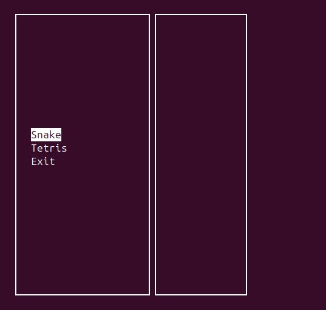
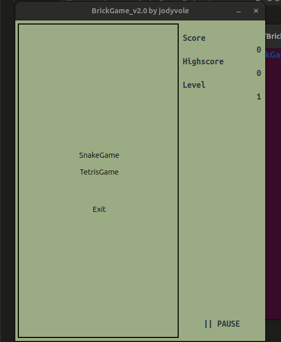

# BrickGame Змейка
В данном проекте реализована игра «Змейка» на языке программирования С++ в парадигме объектно-ориентированного программирования с использованием фреймворка QT6.

Игрок управляет змейкой, которая непрерывно движется вперед. Игрок изменяет направление движения змейки с помощью стрелок. Цель игры заключается в сборе «яблок», появляющихся на игровом поле. При этом игрок не должен касаться стенок игрового поля. После «поедания» очередного «яблока» длина змейки увеличивается на один. Игрок побеждает, если змейка достигает максимального размера (200 «пикселей»). Если змейка сталкивается с границей игрового поля или с собой, то игрок проигрывает.

## Build

`cd src && make install_cli` - Установка терминальной версии игр

`cd src && make install_desktop` - Установка десктопной версии игр (необходимо выполнить предыдущую команду для корректной работы)

`cd src && make uninstall` - Удаление игры и рекордов

>Остальные цели можно прочитать в `src/Makefile`

## Управление:

* Стрелки (→, ←, ↑, ↓) - напраление движения змейки
* Пробел - пауза/возобновить игру
* R - действие
* ESC - выход

## Общая информация

Программа разработана на языке C++ стандарта C++17 и состоит из двух частей: библиотеки, реализующей логику игры змейка, и десктопного интерфейса.

Для формализации логики игры используется конечный автомат на *switch-case*'ах.

Программа реализована с использованием паттерна MVC, с тонким контроллером.

Обе игры (*змейка и тетрис*[BrickGame_v2.0 и BrickGame_v1.0]) поддерживают
- терминальный интерфейс с использованием **ncurses**:

    

- десктопный интерфейс с использованием **QT6**:

    

